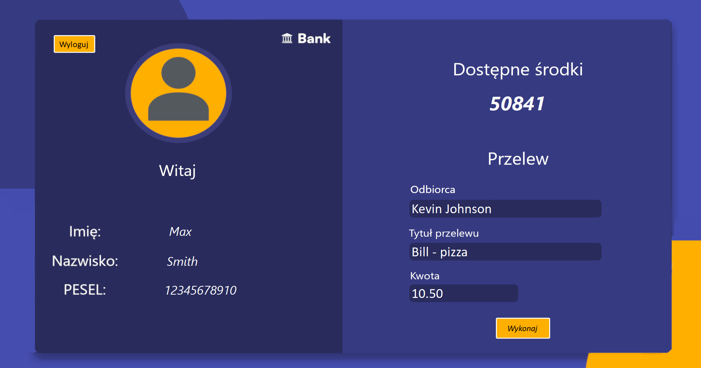

# Bank Application

## Description

Bank Application is a comprehensive desktop application designed to manage bank transfer. The application provides functionalities for user authentication, account management, and transaction processing. It is built using C++ and C# with a focus on providing a robust and user-friendly interface for bank employees and customers.

## Main Features

- **User Authentication**: Secure login functionalities.
- **Account Management**: Create, update, and delete customer accounts.
- **Transaction Processing**: Transfers between accounts.
- **Dashboard**: Overview of account statuses and recent transactions.
- **Registration**: New user registration with validation.

## Technologies Used

- **Programming Languages**: C++, C#
- **Framework**: .NET Framework 4.8 (for C# components)
- **Database System**: Microsoft SQL Server

## Prerequisites

- **Operating System**: Windows 10 or later
- **.NET Framework**: Version 4.8
- **C++ Compiler**: MSVC v143

## TestCaptcha

The `Test Captcha` application is the first stage of running the bank application. It serves as a verification step to ensure that the user is not a robot. Only after successfully passing this test log in screen will appears.

## Screenshots

Here are some screenshots showcasing the main features of the application:

### **Captcha**


### **Register**


### **Login Screen**


### **Dashboard**


### **Logout**


## Getting Started

1. Clone the repository:
    ```sh
    git clone https://github.com/WinterWollf/Bank-application.git
    ```

2. Navigate to the `BankApplication` directory:
   ```sh
   cd BankApplication
   ```
   
3. Open the solution file `BankApplication.sln` in Visual Studio.

4. Build the solution to restore the necessary packages and compile the project.

5. Run the application from Visual Studio.

6. Navigate to the `TestCaptcha` directory:
   ```sh
   cd TestCaptcha
   ```

7. Open the solution file `TestCaptcha.sln` in Visual Studio.

8. Build the solution to restore the necessary packages and compile the project.

9. Run the application from Visual Studio.

## License

This project is licensed under the Creative Commons Attribution-NonCommercial 4.0 International (CC BY-NC 4.0) License - see the [LICENSE](LICENSE.txt) file for details.

## Contact

For any inquiries or feedback, feel free to reach out to the project author:
- **GitHub**: [WinterWollf](https://github.com/WinterWollf)

---
